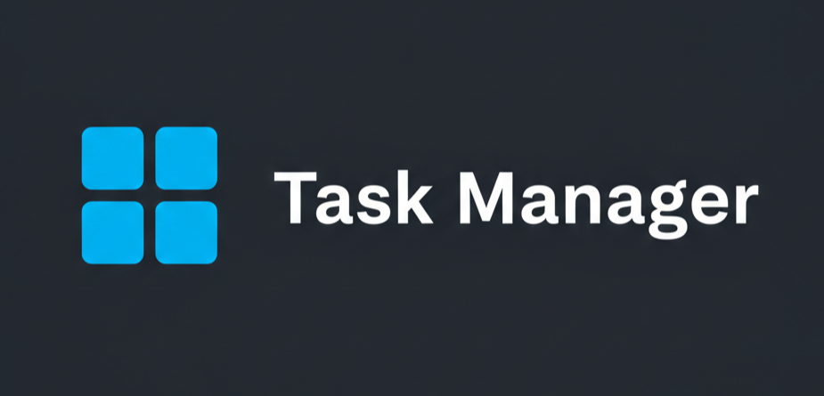

# Task Manager

<div align="center">
    
    
    
    
    
</div>

## Navigation
- [About The Project](#-about-the-project)
- [Tech Stack](#tech-stack)
- [Feautures](#-features)
- [How to use](#language)
- [Getting Started](#-getting-started)
  

## 📋 About The Project
This is a full-stack web application that allows users to manage their tasks with authentication.
It provides a clean and intuitive interface for creating, viewing, editing, and deleting tasks, 
including setting deadlines. The backend is powered by Spring Boot, and the frontend is server-side
rendered using Thymeleaf.

## 🛠️ Tech Stack
- Java 17
- Spring Boot 4 (Spring MVC, Spring Data, Spring Security)
- PostgreSQL
- Thymeleaf
- Maven
- Docker
## ✨ Features

*   **User Authentication:** Registration and login functionality using Spring Security.
*   **Full CRUD Functionality:** Create, read, update, and delete tasks.
*   **Intuitive UI:** A clean and responsive user interface built with Thymeleaf and Bootstrap.
*   **Validation:** Robust server-side validation for all user inputs.
*   **Containerized:** Comes with a `Dockerfile` and `docker-compose.yaml` for easy setup and deployment.

## 🚀 Getting Started

There are two ways to run the application:

#### **1. Using Docker (Recommended)**

This is the easiest way to get the application running with the database.

1.  Clone the repo:
    ```sh
    git clone <https://github.com/Anton3413/Task-Manager.git>
    ```
2.  Navigate to the project directory and run the application using Docker Compose.
    ```sh
    docker-compose up --build
    ```
3.  Open your browser and navigate to `http://localhost:8080`.

#### **2. Using Maven**

If you want to run the application without Docker, you will need to have a PostgreSQL instance running and configure the connection details manually.

1.  Set up a PostgreSQL database.
2.  Configure the database connection by setting the following environment variables:
    *   `SPRING_DATASOURCE_URL`
    *   `SPRING_DATASOURCE_USERNAME`
    *   `SPRING_DATASOURCE_PASSWORD`
3.  Run the application using the Maven wrapper:
    ```sh
    ./mvnw spring-boot:run
    ```
4.  Open your browser and navigate to `http://localhost:8080`.

---
